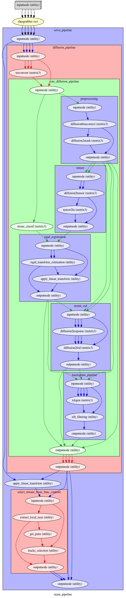

# Structural connectivity of the temporal voice areas (sctva)
The sctva package regroups scripts and pipelines used to study the extrinsic structural connectivity of the temporal voice areas of the human brain
# Installation
We highly recommend to install this package in a virtual environment provided either by venv or conda.
```
git clone  https://github.com/alexpron/sctva
```
## Users 
```
pip install .
```
## Developers
```
pip install -e .['dev']
```
# Current Pipeline Structure
